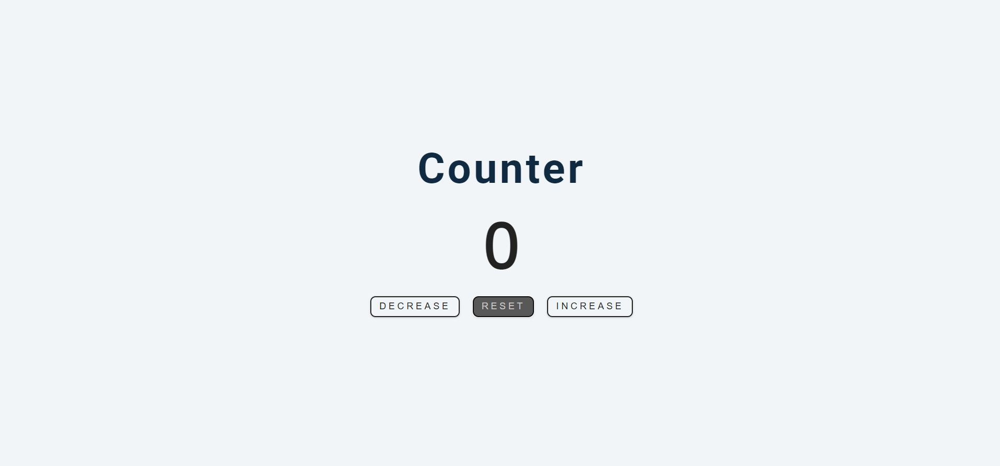
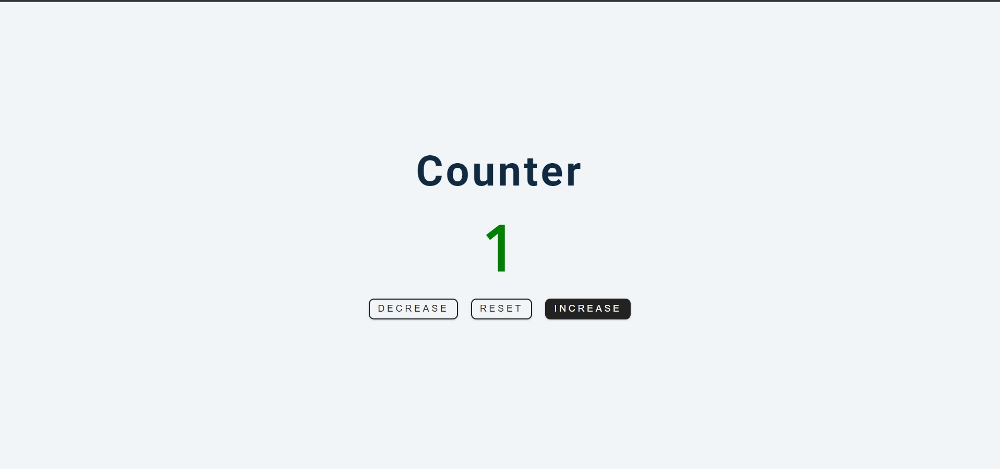
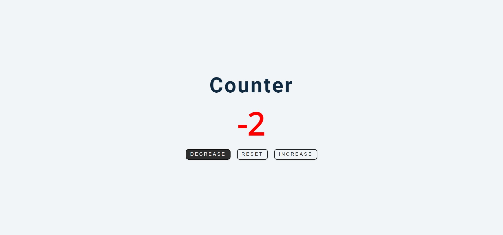

# Counter

This is a solution to the Counter project which is a part of John Smilga's 15 JS projects tutorial.

## Table of contents

- [Overview](#overview)
  - [The challenge](#the-challenge)
  - [Screenshot](#screenshot)
  - [Links](#links)
- [My process](#my-process)
  - [Built with](#built-with)
  - [What I learned](#what-i-learned)
- [Author](#author)

## Overview

### The challenge

Users should be able to:

- View the optimal layout for the app depending on their device's screen size
- See hover states for all interactive elements on the page
- Increment or Decrement the value of the counter
- See the counter color change.

### Screenshot

### Links

- Solution URL: [Solution URL](https://github.com/AshwanthramKL/Counter)
- Live Site URL: [Live site URL](https://ashwanthramkl.github.io/Counter/)

## My process

### Built with

- Semantic HTML5 markup
- CSS custom properties
- Javascript  
- [Font awesome](https://fontawesome.com/)

### What I learned

This project helped me recap over some concepts of CSS and JS such as  Event listerners, DOM manipulation...

## Author

- Website - [MARTIALEAGLE](https://github.com/AshwanthramKL)
- Frontend Mentor - [@AshwanthramKL](https://www.frontendmentor.io/profile/AshwanthramKL)
- Twitter - [@AshwanthramKL](https://www.twitter.com/AshwanthramKL)
